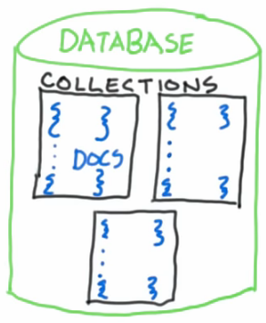

# Introduction

## JSON

- Ref.: [JSON spec](https://www.json.org/json-en.html).
- MongoDB document representation.
- Support any type of hierarchy.
- Structure:
  - Key:
    - Access index.
    - Surround by double quotes.
    - Keys and values must be separated by colons.
    - Fields are separated from one another by commas.
  - Value:
    - Supported types:
      - String:
        - Values surrounded by double quotes.
      - Decimal number (Float point and common numbers).
      - Boolean.
      - null.
      - Array:
        - Values surrounded by square brackets.
        - Ordered comma separated list of values.
        - A single Array can receive values from different types.
      - Objects:
        - Values surrounded by double quotes.
        - Values surrounded by brackets.
- Example:

```json
{
    "string": "It's a string value",
    "number": 0,
    "float_number": 0.1,
    "boolean": true,
    "null": null,
    "array": [
        "It's a string value",
        0,
        0.1,
        true,
        null,
        {
            "type": "It's a object value",
        }
    ],
    {
        "string": "It's a string value",
        "number": 0,
        "float_number": 0.1,
        "boolean": true,
        "null": null,
        "array": [
            "It's a array value"
        ]
    }
}
```

## Structure

- Database serves as a namespace of collections.
- Collection stores individual records (documents).
- Document is the basic MongoDB structure.
- Access control can be implemented in Database, Collection or document levels.



### Document

- Schema statistically described.
- Scalar data types:
  - int32.
  - double.
  - string.
  - date.
- Special data types:
  - document:
    - MongoDB permits multiple levels of nested documents.
    - MOngoDB search by fields inside of any level of nested documents.
  - array:
    - Indexed values of multiple data types.
  - agregate data structure:
    - Mix of data types that has a meaning for third-party programs.
    - Examples:
      - Geospatial Data.

## Filtering and Searching

- MongoDB uses JSON structure to filter or search documents in a collection.
  - Different operations are supported in json filter language.
    - Equal:

```json
// Equal
{bikeid: 16500}

// Greater than | Less than
{bikeid: {$gt: 16500,$lt: 17000}}

// Greater than or equal | Less than or equal
{bikeid: {$gte: 16500,$lte: 17000}}
```
