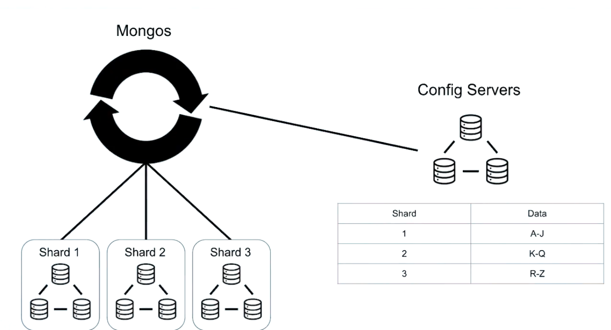

# Sharding

## Sharding Architecture

- Sharded clusters can receive any number of shards. Because that could potentially be a lot of different shards, client applications aren't going to communicate directly with the shards. Instead, it the client connects to **MongoS**, and **MongoS** routes queries to the correct shards.
- We can also have multiple mongos processes from high availability with mongos, or to service multiple applications at once.
- **MongoS** knows exactly how the data is distributed based on **collection metadata**. But the data is not stored on mongos. Instead, the **collection metadata** gets stored in **config servers**, which constantly keep track of where each piece of data lives in the cluster.
  - This is especially important because the information contained on each shard might change with time.
  - So mongos queries the **config servers** often, in case a piece of data is moved.
- The **config servers** have to make sure that there's an even distribution of data across each part. So it redistributes the data based on consumption load.
- Not all the collections in a sharded cluster need to be distributed.
- MongoS (or a randomly chosen shard in the cluster) needs to execute the **Shard Merge** process, gathering results, and then maybe sort the results if the query mandated it.
- Once the shard merge is complete, the mongos will return the results back to the client, but the client won't be aware of any of this.
- It will query this process like a regular mongoD.

### Primary shard

- Each database will be assigned a primary shard, and all the non-sharded collections on that database will remain on that shard.
- The config servers will assign a primary shard to each database once they get created.
  - But we can also change the primary shard of a database.
- The primary shard also has a few other responsibilities, specifically around merge operations for aggregation commands.

### Example

